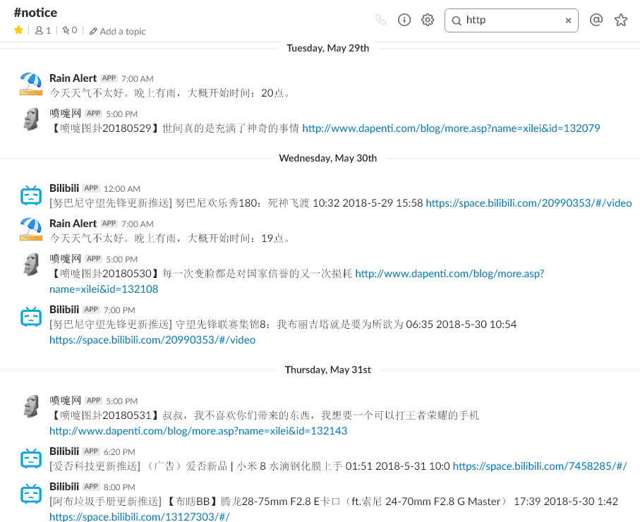

# 一个基于 MongoDB 的 Python Web 信息推送框架

## 程序简要说明

这是一个小型的Python项目，本来设计用来抓取bilibili的订阅更新，然后推送到我的Slack上。就这一个简单的功能：JSON解析-REQUEST发送一个POST就可以了。我在这个项目最开始的版本中使用的是Pickle，用它来作已推送更新的记录。我把这个脚本上传到了服务器，然后使用Corn定时任务，每隔半个小时从bilibili服务器获取一次数据，用了半个月，感觉还不错。

除了bilibili，我还有zimuzu美剧更新推送的需求，因此照葫芦画瓢搞了个zimuzuChecker，同样设置了一个定时器。

这没什么问题，一直到一两个月以后。某天，我突发奇想，想要程序每天早上七点自动去获取一下天气，然后如果有雨的话，给我推送消息。那个时候我热衷于在淘宝买东西，因此特别想要跟踪快递消息。但是每次打开淘宝或者菜鸟太麻烦，因此这些需求整合在一起，就诞生了这个程序。

第一步的思考是：使用corn定时，但这个不太现实。因为我需要捕获的信息，都是放在一个config的配置文件中，然后Python脚本进行读取的，总不能每次买了东西，都要跑到服务器上，更改一下配置文件。于是，我就想要把数据，包括这些需要推送的项目，还有已经推送过的项目，放在数据库中，而不是一个Pickle文件里。实际上，Pickle文件是一个很差的选择，一是它的大小和频繁读取问题，二是读写性能问题。我选择了MongoDB，而不是MySQL，原因很简单，当时我只会MongoDB。其实这个选择还是有些问题的，比如不能够按照表格来建立严格的OO模型。

我折腾了很久，包括数据库的可持续读写，推送信息以及数据写入。当初的指导思想是——结构化和解耦。因此我设计了三个模块，每个模块都负责一类数据的处理，比如bilibiliChecker和zimuzuChecker之类，这些类本来是用作完成独立的cron任务的，所以本身就包含了以Pickle为数据存储的完整的读写和数据推送能力。为了方便，我也没改，就直接在类的后面添加了一个用于数据库使用的新方法。

大体思路是这样。首先cron负责定时，然后python中的一个定时(Schedule)类去数据库抽取项目，然后看看当前时间哪个项目需要运行，就将这个项目完整的数据，包括索引信息和已经保存的数据从数据库中抽取出来，然后使用这些模块来根据数据库提供的地址获取信息，然后返回三个内容，一是是否继续推送（因为快递的话，签收就不用推送了），二是要写入数据库的信息，三是要推送给用户的信息。之后再由MetaItem（这是一个数据库行的OO表示）类进行数据推送，并且保存数据到数据库。

这个程序的第一个大版本是面向过程的，所有内容都堆在checker.py文件中，后来实在是太过于杂乱，我对这个版本进行了面向对象的重构。同时也是在这个版本中添加了不同的定时方法，比如在某个时刻执行，在某个时间段以某个频率执行（比如快递，如果一天二十四小时，每小时检查一次，API价钱太贵了，因此只在白天检查）。也是在这个版本中，我添加了更多的子类，比如天气推送、喷嚏图卦推送，对于后来这些模块，我直接使用了简单的函数而不是一个完整的类。

同时，在新版本中，我将那些私密的信息，比如Slack的地址、API密钥还有数据库密码都放在了config.py文件中。这个版本大概做到了结构化，每个模块功能很清晰。

其中 connect.py 模块来自于别的项目，用来进行MongoDB的持久化连接，我还根据这个模块创建了一个子类，在 frame.py 的 TransDB 类中，用以进行数据库连接和读写。 checker.py 模块第二版本进行了精简，只包含程序主要的步骤，比如控制数据库连接的API，控制日志记录的代码，控制总体流程（创建Schedule实例->获取头文件->检查哪些项目当前需要更新->构造MetaItem实例->获取这些项目全部数据并保存在类方法中->使用类方法提供的子模块提供的方法进行数据获取，并返回需要保存/推送的数据->判断当前项目需要推送还是保存->调用MetaItem类方法进行保存或者推送）

而MetaItem则放在frame.py 中，它的 goCheck 子方法用来连接各种各样的模块用以获取数据。这个方法中，我使用了一个很 magic 的编程 style，就是装饰器，编写了两个装饰器，分别用来进行数据检查和数据推送。装饰器是Python一个高级的语法特性，在类方法中，它被用来截取对类方法的调用，我们使用一个类装饰器，这意味着这个装饰器是一个类，这个类截获了被调用的类方法的类，并且具有了其类的所有属性，这意味着我们伪造了一个类，并且可以使用这个伪造的类的任何数据，同时对这个伪造类的更改不会影响MetaItem本身，这很神奇。虽然没什么用，在目前功能的代码里，不过，也算实现了解耦——所有外部的模块，提供的获取数据的方法，都要经过这个装饰器，而我们就不用关心在MetaItem中发生的事情了。

frame.py 还包含一个叫做 Schedule 的类，这个类单纯是用来在cron每分钟调用的时候判断当前时间是否是运行频率的倍数，如果是，并且在项目规定的范围内，那么就调用MetaItem的获取数据接口，进行检查和推送。对于每个数据而言，自从被从数据库取出来，第一步都是在Schedule中被构造为MetaItem实例，为了节省内存，在这个时候没有完全读取数据，只获取了项目的名称以及其运行频率等信息，如果在这一分钟需要运行，则继续从数据库获取信息来补全这个实例。

## 框架使用指南

创建 .py 模块文件，并且将数据（密钥等）放在 config.py 中，将模块文件中用以获取数据的类/函数和 config 的 model 下的 func 联系起来，这里的类型名称(比如 bilibili)你可以自定义，不过需要在数据库中填入对应的类型，以确保程序在 config.py 中找到对应的函数以执行相应程序。slack_url 字段填入 Slack WebHook地址。

config.py 文件中应包含数据库的地址、用户名和密码，数据库名和表名，重试次数，只支持 MongoDB。

推送效果如下：

## 学习 Python 的终点 & 编程的起点

一句话来说，这个程序就是包装稍微简陋点的CRUD外层代码块，对于数据库对象定义了一个OOP对象——MetaItem，然后根据主体流程——检查、构造、获取数据、推送、保存来分别调用这个对象的一些类方法。外围代码，比如日志流控制，错误控制，数据库可持续化都不是核心内容。这个程序我比较满意的地方在于 config.py 的数据解耦和 goCheck 的装饰器接口，所有外部获取数据的方法通过此接口获取必要信息，然后返回数据。

不像 Django 让你自己创建 model，并且使用 migtate 更新 MySQL 表结构，在这个程序中，表结构是固定的，因此对于外部接口要求其将一坨数据进行拆分和合并，稍显繁琐。但是对于推送系统而言，还不算太复杂。况且，Python有着极其优秀的字符串处理函数库，实际编写很简单，如果是定时程序，而不用考虑数据存取的，那就更简单了，比如下雨提醒。

这是我写的第一个OO程序，或许还不非常的OO，但是我确实一直在思考如何去建构这个系统，这就是它现在的样子。需要提的一点是，我在这个项目之前，学习Python之前，没有计算机导论以及C的科班基础，草台班子，读了基本语法书，照葫芦画瓢，搞出这个东西——所以说，如果觉得这个程序写的奇怪，也不要感到奇怪。我在后来的GUI中才稍微体会到了一点OO的妙处，同时回过头来，在Coursera上开始了计算机基础知识和基本原理的恶补。

如果用一句话形容之前的状态，那么我觉得最合适的就是“横冲直撞”。因此，当我试图去构建一个稍微大一点的项目的时候，就越来越感到吃力。程序设计的核心在于“设计”。现在回过头来，看看这个程序，就是一CRUD的类封装，如果我当初能够意识到这一点，或许开发也不会遇到很多阻碍，不会考虑这个类和这个类是什么关系，要构建几个类，是用函数返回一个东西还是用一个类，然后创建一个方法来充当这个函数这种问题。很多人说，没有抉择就很难成长，但我的看法是，就像登山模型，如果一味往前，只知道目标，而看不清路（工具和其创造理念）的话，很容易陷入各个小山头，这种局部最优状态就表现在上面那些困难的选择上，而对于工具和其构成有了了解后，对于需要解决的问题有了总体性观念后，进行架构性的设计，之后再分别解耦部分，进行编程，我觉得这才是编程的乐趣所在。所以说，这个项目用血和泪的经验告诉我：“算法和数据结构”是程序的灵魂。只有抓住主干，才能事半功倍。

我在重构的过程中的过程中非常痛苦，大概就是这个原因。各种选择，其实都不必，视角不同，采用的解决办法也不同。

所以，将这个程序作为我 Python PlayGround 的终点是一个不错的选择，起码它可用，并且也不算太坏。在写这段文字的时候，它已经在我的服务器上运行了三个多月了，没出过什么问题，推送的消息也有1000余条了。我没有对它继续重构的计划，因为我目前的精力主要集中在算法和数据结构上，这是我学习Python的一个终点，也是开始编程之旅的一个起点。

二〇一八年六月五日